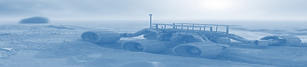
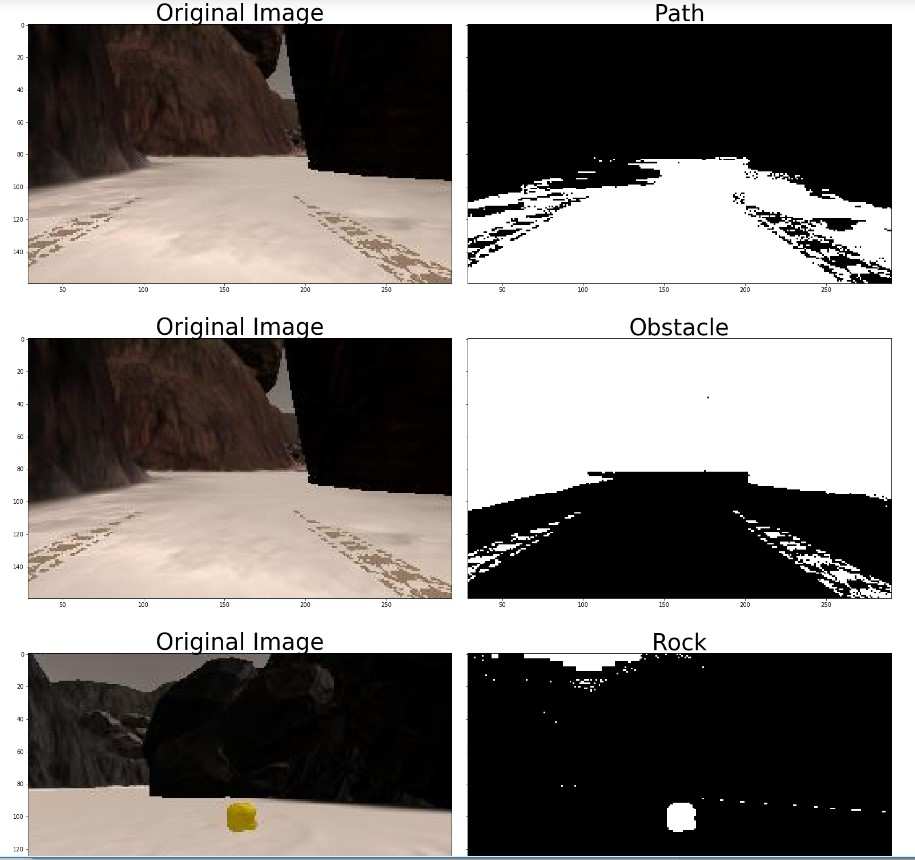
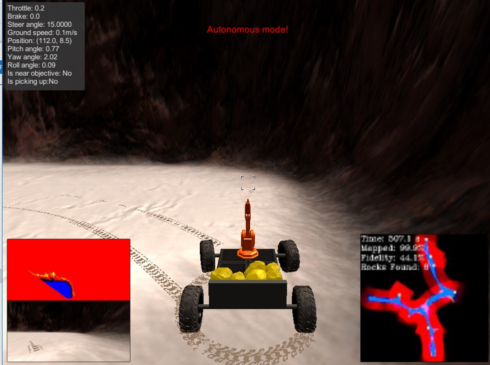


## Project: Search and Sample Return
 
This project is modeled after the [NASA sample return challenge](https://www.nasa.gov/directorates/spacetech/centennial_challenges/sample_return_robot/index.html) and it will give you first hand experience with the three essential elements of robotics, which are perception, decision making and actuation.  You will carry out this project in a simulator environment built with the Unity game engine.  

## The Simulator
The first step is to download the simulator build that's appropriate for your operating system.  Here are the links for [Linux](https://s3-us-west-1.amazonaws.com/udacity-robotics/Rover+Unity+Sims/Linux_Roversim.zip), [Mac](	https://s3-us-west-1.amazonaws.com/udacity-robotics/Rover+Unity+Sims/Mac_Roversim.zip), or [Windows](https://s3-us-west-1.amazonaws.com/udacity-robotics/Rover+Unity+Sims/Windows_Roversim.zip).  

You can test out the simulator by opening it up and choosing "Training Mode".  Use the mouse or keyboard to navigate around the environment and see how it looks.

## Dependencies
You'll need Python 3 and Jupyter Notebooks installed to do this project.  The best way to get setup with these if you are not already is to use Anaconda following along with the [RoboND-Python-Starterkit](https://github.com/ryan-keenan/RoboND-Python-Starterkit). 


## [Rubric](https://review.udacity.com/#!/rubrics/916/view) Points
 

---
1. Notebook File: /code/Rover_Project_Test_Notebook.ipynb
2. perception.py: /code/perception.py
3. decysion.py: /code/decision.py
3. Output Video: output/test_mapping.mp4

### Writeup / README

#### 1. Provide a Writeup / README that includes all the rubric points and how you addressed each one.  You can submit your writeup as markdown or pdf.  

This document

### Notebook Analysis
#### 1. Run the functions provided in the notebook on test images (first with the test data provided, next on data you have recorded). Add/modify functions to allow for color selection of obstacles and rock samples.

For the identification the values (160,160,160) as threshold worked reasonably good.

```
def color_thresh(img, rgb_thresh=(160, 160, 160)):

    # Create an array of zeros same xy size as img, but single channel
    color_select = np.zeros_like(img[:,:,0])
    # Require that each pixel be above all three threshold values in RGB
    # above_thresh will now contain a boolean array with "True"
    # where threshold was met
    above_thresh = (img[:,:,0] > rgb_thresh[0]) \
                & (img[:,:,1] > rgb_thresh[1]) \
                & (img[:,:,2] > rgb_thresh[2])
    # Index the array of zeros with the boolean array and set to 1
    color_select[above_thresh] = 1
    # Return the binary image
    return color_select```

For the selection of the obstacles the simple solution was just to invert the threshold. Whatever is not path is an obstacle:


```def color_thresh_obst(img, rgb_thresh=(160, 160, 160)):

    # Create an array of zeros same xy size as img, but single channel
    color_select = np.zeros_like(img[:,:,0])
    # Require that each pixel be above all three threshold values in RGB
    # above_thresh will now contain a boolean array with "True"
    # where threshold was met
    below_thresh = (img[:,:,0] < rgb_thresh[0]) \
                & (img[:,:,1] < rgb_thresh[1]) \
                & (img[:,:,2] < rgb_thresh[2])
    # Index the array of zeros with the boolean array and set to 1
    color_select[below_thresh] = 1
    # Return the binary image
    return color_select```

For the selection of the rocks 20, 100, 100 as a yellow value worked fine while staying bellow 100 on blue and above 20 and 100 on red and green.

```
def color_thresh_rock(img, rgb_thresh=(20, 100, 100)):

    # Create an array of zeros same xy size as img, but single channel
    color_select = np.zeros_like(img[:,:,0])
    # Require that each pixel be above all three threshold values in RGB
    # above_thresh will now contain a boolean array with "True"
    # where threshold was met
    rock_thresh = (img[:,:,0] > rgb_thresh[0]) \
                & (img[:,:,1] > rgb_thresh[1]) \
                & (img[:,:,2] < rgb_thresh[2])
    # Index the array of zeros with the boolean array and set to 1
    color_select[rock_thresh] = 1
    # Return the binary image
    return color_select
```



#### 1. Populate the `process_image()` function with the appropriate analysis steps to map pixels identifying navigable terrain, obstacles and rock samples into a worldmap.  Run `process_image()` on your test data using the `moviepy` functions provided to create video output of your result. 

1) Define source and destination points for perspective transform

```
    dst_size = 5 
    bottom_offset = 6
    source = np.float32([[14, 140], [301 ,140],[200, 96], [118, 96]])
    destination = np.float32([[img.shape[1]/2 - dst_size, img.shape[0] - bottom_offset],
                  [img.shape[1]/2 + dst_size, img.shape[0] - bottom_offset],
                  [img.shape[1]/2 + dst_size, img.shape[0] - 2*dst_size - bottom_offset], 
                  [img.shape[1]/2 - dst_size, img.shape[0] - 2*dst_size - bottom_offset]])
```
2) Apply perspective transform
```
    warped = perspect_transform(img, source, destination)

```
    
3) Apply color threshold to identify navigable terrain/obstacles/rock samples based on the identified threshold values

```
    threshed_path = color_thresh(warped, rgb_thresh=(160, 160, 160))
    threshed_obst = color_thresh_obst(warped, rgb_thresh=(160, 160, 160))
    threshed_rock = color_thresh_rock(warped, rgb_thresh=(20, 100, 100))
```

4) Convert thresholded image pixel values to rover-centric cords

```
    #xpix, ypix = rover_coords(threshed)
    
    path_xpix, path_ypix = rover_coords(threshed_path)
    obstacles_xpix, obstacles_ypix = rover_coords(threshed_obst)
    rocks_xpix, rocks_ypix = rover_coords(threshed_rock)
```
    
5) Convert rover-centric pixel values to world cords

```
    #dist, angles = to_polar_coords(xpix, ypix)
    
    xpos, ypos, yaw = data.xpos[data.count], data.ypos[data.count], data.yaw[data.count]
    world_size = data.worldmap.shape[0]
    scale = 10
    path_x_world, path_y_world = pix_to_world(path_xpix, path_ypix, xpos, ypos, yaw, world_size, scale)
    obstacles_x_world, obstacles_y_world = pix_to_world(obstacles_xpix, obstacles_ypix, xpos, ypos, yaw, world_size, scale)
    rocks_x_world, rocks_y_world = pix_to_world(rocks_xpix, rocks_ypix, xpos, ypos, yaw, world_size, scale)
    
    # 6) Update worldmap (to be displayed on right side of screen)
        # Example: data.worldmap[obstacle_y_world, obstacle_x_world, 0] += 1
        #          data.worldmap[rock_y_world, rock_x_world, 1] += 1
        #          data.worldmap[navigable_y_world, navigable_x_world, 2] += 1
   # scale = 10
   # x_world, y_world = pix_to_world(xpix, ypix, data.xpos[data.count], data.ypos[data.count], data.yaw[data.count], data.worldmap.shape[0], scale)
   # data.worldmap[y_world, x_world, 2] += 1

    data.worldmap[path_y_world, path_x_world, 0] +=1
    data.worldmap[rocks_y_world, rocks_x_world, 1] +=1
    data.worldmap[obstacles_y_world, obstacles_x_world, 2] +=1

```
    
7) Make a mosaic image, below is some example code

```
        # First create a blank image (can be whatever shape you like)
    output_image = np.zeros((img.shape[0] + data.worldmap.shape[0], img.shape[1]*2, 3))
        # Next you can populate regions of the image with various output
        # Here I'm putting the original image in the upper left hand corner
    output_image[0:img.shape[0], 0:img.shape[1]] = img

        # Let's create more images to add to the mosaic, first a warped image
    warped = perspect_transform(img, source, destination)
        # Add the warped image in the upper right hand corner
    output_image[0:img.shape[0], img.shape[1]:] = warped  
    
          # Overlay worldmap with ground truth map
    map_add = cv2.addWeighted(data.worldmap, 1, data.ground_truth, 0.5, 0)
        # Flip map overlay so y-axis points upward and add to output_image 
    output_image[img.shape[0]:, 0:data.worldmap.shape[1]] = map_add
        
        # Overlay worldmap with path in blue
    output_image[img.shape[0]:, 0:data.worldmap.shape[1], 2][path_y_world, path_x_world] += 255
        # Overlay worldmap with obstacles in red
    output_image[img.shape[0]:, 0:data.worldmap.shape[1], 0][obstacles_y_world, obstacles_x_world] += 255  
        # Overlay worldmap with rocks in green
    output_image[img.shape[0]:, 0:data.worldmap.shape[1], 1][rocks_y_world, rocks_x_world] += 255    
        
        # Then putting some text over the image
    cv2.putText(output_image,"Map generation", (20, 20), 
                cv2.FONT_HERSHEY_COMPLEX, 0.4, (255, 255, 255), 1)
    data.count += 1 # Keep track of the index in the Databucket()

```
the result can be found under: output/test.mapping.mp4

### Autonomous Navigation and Mapping

#### 1. Fill in the `perception_step()` (at the bottom of the `perception.py` script) and `decision_step()` (in `decision.py`) functions in the autonomous mapping scripts and an explanation is provided in the writeup of how and why these functions were modified as they were.

1) Define source and destination points for perspective transform

```
    
    # important to remmebert where the image is now actually coming from!!!!!!!!!!
    img = Rover.img
    dst_size = 5 
    bottom_offset = 6
    source = np.float32([[14, 140], [301 ,140],[200, 96], [118, 96]])
    destination = np.float32([[img.shape[1]/2 - dst_size, img.shape[0] - bottom_offset],
                  [img.shape[1]/2 + dst_size, img.shape[0] - bottom_offset],
                  [img.shape[1]/2 + dst_size, img.shape[0] - 2*dst_size - bottom_offset], 
                  [img.shape[1]/2 - dst_size, img.shape[0] - 2*dst_size - bottom_offset]])
```    

2) Apply perspective transform

```
    warped = perspect_transform(img, source, destination)
```
    
3) Apply color threshold to identify navigable terrain/obstacles/rock samples

```
    threshed_path = color_thresh(warped, rgb_thresh=(160, 160, 160))
    threshed_obst = color_thresh_obst(warped, rgb_thresh=(160, 160, 160))
    threshed_rock = color_thresh_rock(warped, rgb_thresh=(20, 100, 100))
```    
    
4) Update Rover.vision_image (this will be displayed on left side of screen)
```

        # Example: Rover.vision_image[:,:,0] = obstacle color-thresholded binary image
        #          Rover.vision_image[:,:,1] = rock_sample color-thresholded binary image
        #          Rover.vision_image[:,:,2] = navigable terrain color-thresholded binary image
        
    Rover.vision_image[:, :, 0] = threshed_obst * 255
    Rover.vision_image[:, :, 1] = threshed_rock * 255
    Rover.vision_image[:, :, 2] = threshed_path * 255   
```
        
5) Convert map image pixel values to rover-centric coords
```    
    path_xpix, path_ypix = rover_coords(threshed_path)
    obstacles_xpix, obstacles_ypix = rover_coords(threshed_obst)
    rocks_xpix, rocks_ypix = rover_coords(threshed_rock)

```
    
    
6) Convert rover-centric pixel values to world coordinates. The if clauses to keep the roll and pitch in threshold was required to improve the fidelity.
```  
    xpos, ypos, yaw = Rover.pos[0], Rover.pos[1], Rover.yaw
    world_size = Rover.worldmap.shape[0]
    scale = 10
    path_x_world, path_y_world = pix_to_world(path_xpix, path_ypix, xpos, ypos, yaw, world_size, scale)
    obstacles_x_world, obstacles_y_world = pix_to_world(obstacles_xpix, obstacles_ypix, xpos, ypos, yaw, world_size, scale)
    rocks_x_world, rocks_y_world = pix_to_world(rocks_xpix, rocks_ypix, xpos, ypos, yaw, world_size, scale)  
    
    
    # 7) Update Rover worldmap (to be displayed on right side of screen)
        # Example: Rover.worldmap[obstacle_y_world, obstacle_x_world, 0] += 1
        #          Rover.worldmap[rock_y_world, rock_x_world, 1] += 1
        #          Rover.worldmap[navigable_y_world, navigable_x_world, 2] += 1
        
    if Rover.roll < 2.0 or Rover.roll > 358:
        if Rover.pitch < 2.0 or Rover.pitch > 358:
            Rover.worldmap[path_y_world, path_x_world, 2] += 255
            Rover.worldmap[rocks_y_world, rocks_x_world, 1] += 255
            Rover.worldmap[obstacles_y_world, obstacles_x_world, 0] += 255
```

8) Convert rover-centric pixel positions to polar coordinates

```
    # Update Rover pixel distances and angles
        # Rover.nav_dists = rover_centric_pixel_distances
        # Rover.nav_angles = rover_centric_angles
    
    Rover.nav_dists, Rover.nav_angles = to_polar_coords(path_xpix, path_ypix)
    Rover.rocks_dists, Rover.rocks_angles = to_polar_coords(rocks_xpix, rocks_ypix)
    Rover.obstcls_dists, Rover.obstcls_angles = to_polar_coords(obstacles_xpix, obstacles_ypix)


For the decision step it was important to understand first the various rover states and to observe the telemetric data for breaks, throttle etc. in the various  situations.  This was the basis for creating the decision steps.

'''
    
    if Rover.nav_angles is not None:


        if Rover.near_sample and Rover.vel == 0 and not Rover.picking_up:

            Rover.send_pickup = True
            Rover.picking_up == 1
            Rover.throttle = 0
            Rover.steer = 0
            Rover.brake = Rover.brake_set
            Rover.mode = 'stop'

        elif Rover.near_sample == 1:
            Rover.brake = Rover.brake_set
            Rover.mode = 'stop'
            Rover.steer = 0



        elif Rover.mode == 'rock_visible':
            if Rover.vel < Rover.max_vel:
                # Set throttle value to throttle setting
                Rover.throttle = Rover.throttle_set
            else: # Else coast
                Rover.throttle = 0
            Rover.brake = 0
            # Set steering to average angle clipped to the range +/- 15
            Rover.steer = np.clip(np.mean(Rover.nav_angles * 180/np.pi), -15, 15)

        # Check for Rover.mode status
        elif Rover.mode == 'forward': 
            # Check the extent of navigable terrain
            if len(Rover.nav_angles) >= Rover.stop_forward:  
                # If mode is forward, navigable terrain looks good 
                # and velocity is below max, then throttle 
                if Rover.vel < Rover.max_vel:
                    # Set throttle value to throttle setting
                    Rover.throttle = Rover.throttle_set
                else: # Else coast
                    Rover.throttle = 0
                Rover.brake = 0
                # Set steering to average angle clipped to the range +/- 15
                Rover.steer = np.clip(np.mean(Rover.nav_angles * 180/np.pi), -15, 15)
            # If there's a lack of navigable terrain pixels then go to 'stop' mode
            elif len(Rover.nav_angles) < Rover.stop_forward:
                # Set mode to "stop" and hit the brakes!
                Rover.throttle = 0
                # Set brake to stored brake value
                Rover.brake = Rover.brake_set
                Rover.steer = 0
                Rover.mode = 'stop'

        # If we're already in "stop" mode then make different decisions
        elif Rover.mode == 'stop':
            # If we're in stop mode but still moving keep braking
            if Rover.vel > 0.2:
                Rover.throttle = 0
                Rover.brake = Rover.brake_set
                Rover.steer = 0
            # If we're not moving (vel < 0.2) then do something else
            elif Rover.vel <= 0.2:
                # Now we're stopped and we have vision data to see if there's a path forward
                if len(Rover.nav_angles) < Rover.go_forward:
                    Rover.throttle = 0
                    # Release the brake to allow turning
                    Rover.brake = 0
                    # Turn range is +/- 15 degrees, when stopped the next line will induce 4-wheel turning
                    # Check where there is more open terrain, on left or right
                    if Rover.steer == 0:
                        Rover.steer = -15 if np.clip(np.mean(Rover.nav_angles * 180/np.pi), -15, 15) < 0 else 15                                                                                                                        
                # If we're stopped but see sufficient navigable terrain in front then go!
                if len(Rover.nav_angles) >= Rover.go_forward:
                    # Set throttle back to stored value
                    Rover.throttle = Rover.throttle_set
                    # Release the brake
                    Rover.brake = 0
                    # Set steer to mean angle of mean angle of terrain angles and mean angle of wall angles
                    Rover.steer = np.clip(np.mean(Rover.nav_angles * 180/np.pi), -15, 15)
                    Rover.mode = 'forward'
    # Just to make the rover do something 
    # even if no modifications have been made to the code
    else:
        Rover.throttle = Rover.throttle_set
        Rover.steer = 0
        Rover.brake = 0

```
#### 2. Launching in autonomous mode your rover can navigate and map autonomously.  Explain your results and how you might improve them in your writeup.  

Launching in autonomous mode the rover was able to navigate autonomously. The fidelity was above 40% at above 90% of the map covered. The results where achieved at a resolution of 1024 * 768 and fastest graphic quality with the 64bit win version of 29th of may.



Further improvement would be required to ensure that the rover:

a) moves automatically towards the identified rocks
b) follows an calculated optimized path for mapping and collection based on the identified map


![alt text][image3]



